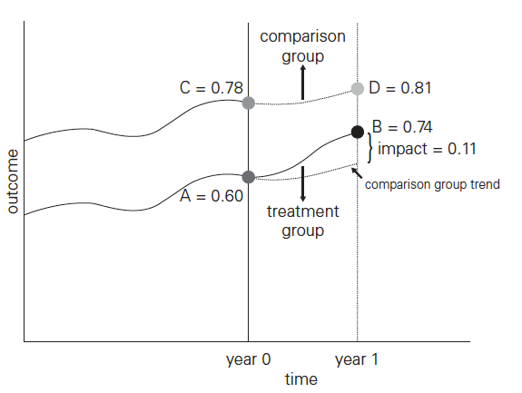
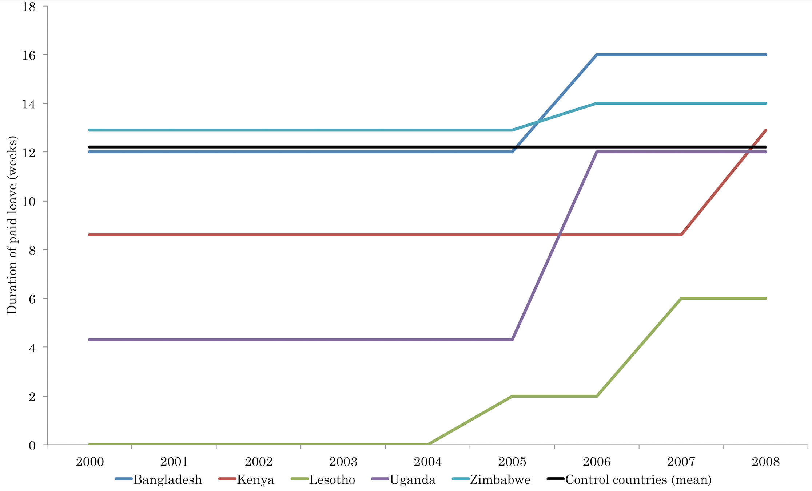

```{r setup, include=FALSE}
library(here)
library(tidyverse)
library(ggplot2)
options(htmltools.dir.version = FALSE)
library(DiagrammeR)
library(xaringan)
library(leaflet)
library(ggplot2)
library(kableExtra)
library(fixest)
library(modelsummary)
# devtools::install_github("bcallaway11/did")
library(did)
library(lme4)
library(RStata)
options("RStata.StataVersion" = 16)
options("RStata.StataPath"= '/Applications/Stata/StataMP.app/Contents/MacOS/stata-mp')
library(RefManageR)
xfun::pkg_load2(c('tikzDevice', 'magick', 'pdftools'))
source("helper.R")
BibOptions(check.entries = FALSE, 
           bib.style = "authoryear", style = "markdown",
           dashed = TRUE, max.names=1)
bib <- ReadBib("PPHS617.bib")
```

```{r, include=FALSE}
pdf2png = function(path) {
  # only do the conversion for non-LaTeX output
  if (knitr::is_latex_output()) return(path)
  path2 = xfun::with_ext(path, "png")
  img = magick::image_read_pdf(path)
  magick::image_write(img, path2, format = "png")
  path2
}
```

```{r xaringan-themer, include=FALSE}
library(xaringanthemer)
write_xaringan_theme(text_color = "#000000", header_color = "#737373", text_font_size = "24px",  text_font_family = "'Lucida Sans'", header_font_google = google_font("Source Sans Pro"), title_slide_background_color =  "#ffffff", title_slide_text_color = "#000000", link_color = "#0000ee", footnote_font_size = "0.5em")
```
## Thinking about research design

.left-column[
```{tikz rd, echo=F, out.width="90%", cache=TRUE}
\begin{tikzpicture}[transform shape]
\tikzset{> = stealth}
    \node (z) at (-0.75,-0.75) {$Z$};
    \node (c) at (0.5, 0) {$C$};
    \node (t) at (0,-0.75) {$T$};
    \node (y) at (1,-0.75) {$Y$};
    \node (u) at (0.5, -1.5) {$U$};
    \path[->] (t) edge (y);
    \path[->] (c) edge (t);
    \path[->] (c) edge (y);
    \path[->] (u) edge (t);
    \path[->] (u) edge (y);
\end{tikzpicture}
```
]

.right-column[
- Goal: estimate treatment [ban] effect $(T)$ on our outcomes $(Y)$.

- Recall the potential outcomes framework. We want to estimate what *would have happened* in ban villages without the ban:

$$E[Y^{1}-Y^{0}]=E[Y^{1}|T=1]-E[Y^{0}|T=0]$$

- Where should we get our counterfactual?

- Ideally randomize $(Z)$, but not feasible.
- Instead we can control for covariates $(C)$, but still worry about unmeasured confounders $(U)$.
]

---
.left-column[
### T vs. C after ban?

- Could compare "ban" and "no ban" villages after policy.

- Treated and control villages may differ in ways that are hard to measure.
]

..right-column[
```{tikz dd1, echo=F, out.width="95%", cache=TRUE}
\begin{tikzpicture}[scale=2]
    \draw [<->,thick] (0,3) node (yaxis) [above] {$y$} |- (4,0) node (xaxis) [right] {$time$};
	\draw[thick, color=black, dashed] (2,0) coordinate (t0_0) -- (2,3) coordinate (t0_1);
	\coordinate (T) at (4.5,2.1);
    \fill[red] (T) circle (1pt) node[right, color=black] {Treated};
	\coordinate (C) at (4.5,1.8);
    \fill[blue] (C) circle (1pt) node[right, color=black] {Control};
	
	\draw[thick, -> ] (2.6,2.9) coordinate (t0_0) node[right] {Intervention} -- (2.1,2.9) coordinate (t0_1);

	\coordinate (o1) at (2.5,1.5);
	\fill[blue] (o1) circle (1.5pt);
	\coordinate (o2) at (2.5,2);
	\fill[red] (o2) circle (1.5pt);
	\fill[blue] (o1) circle (1.5pt) node[right=0.2cm, align=left] {Potential confounding \\ by group?};
	
\end{tikzpicture}
```
]

---
.left-column[
### Pre-post in treated?

- Could compare "ban" villages before vs. after policy.

- Other factors affecting $(Y)$ can lead to bias.
]

..right-column[
```{tikz dd2, echo=F, out.width="95%", cache=TRUE}
\begin{tikzpicture}[scale=2]
    
	% Draw axes
    \draw [<->,thick] (0,3) node (yaxis) [above] {$y$} |- (4,0) node (xaxis) [right] {$time$};
	\draw[thick, color=black, dashed] (2,0) coordinate (t0_0) -- (2,3) coordinate (t0_1);
	
	% Legend
	\coordinate (T) at (4.5,2.1);
    \fill[red] (T) circle (1pt) node[right, color=black] {Treated};
	\coordinate (C) at (4.5,1.8);
    \fill[blue] (C) circle (1pt) node[right, color=black] {Control};
	
	% Intervention line
	\draw[thick, -> ] (2.6,2.9) coordinate (t0_0) node[right] {Intervention} -- (2.1,2.9) coordinate (t0_1);

	% Data points
	\coordinate (o1) at (1.5,1.5);
	\fill[red] (o1) circle (1.5pt);
	\coordinate (o2) at (2.5,2);
	\fill[red] (o2) circle (1.5pt);

	\draw[thick,color=red,-] (o1) -- (o2);
	\coordinate (c1) at (2.5,1.5);
	\fill[red] (c1) circle (1.5pt);
	\draw[thick,color=red,dashed,-] (o1) -- (c1) node[right=0.2cm, align=left] {Potential confounding \\ by time?};
	
\end{tikzpicture}
```
]

---
.left-column[
### Add pretests for both

- Compares pre/post in treated and untreated.

- Captures all time-invariant group diffs.

- Captures all group-invariant time trends.
]

..right-column[
```{tikz dd3, echo=F, out.width="95%", cache=TRUE}
\begin{tikzpicture}[scale=2]
    
	% Draw axes
    \draw [<->,thick] (0,3) node (yaxis) [above] {$y$} |- (4,0) node (xaxis) [right] {$time$};
	\draw[thick, color=black, dashed] (2,0) coordinate (t0_0) -- (2,3) coordinate (t0_1);
	
	% Legend
	\coordinate (T) at (4.5,2.1);
    \fill[red] (T) circle (1pt) node[right, color=black] {Treated};
	\coordinate (C) at (4.5,1.8);
    \fill[blue] (C) circle (1pt) node[right, color=black] {Control};
	
	% Intervention line
	\draw[thick, -> ] (2.6,2.9) coordinate (t0_0) node[right] {Intervention} -- (2.1,2.9) coordinate (t0_1);

	% Data points
	\coordinate (c0) at (1.5,1.5);
	\fill[blue] (c0) circle (1.5pt);
	\coordinate (t0) at (1.5,1.7);
	\fill[red] (t0) circle (1.5pt);
	\coordinate (c1) at (2.5,1.5);
	\fill[blue] (c1) circle (1.5pt);
	\coordinate (t1) at (2.5,2);
	\fill[red] (t1) circle (1.5pt);

	\draw[thick,color=blue,-] (c0) -- (c1) node[right=0.2cm, align=left] {Control group estimates \\ counterfactual trend};
	\draw[thick,color=red,-] (t0) -- (t1);
	
\end{tikzpicture}
```
]

---
## Difference-in-Differences: Basic Idea
.left-column[
```{tikz, echo=F}
\begin{tikzpicture}[transform shape]
\tikzset{> = stealth}
    \node (g) at (1,1) {$Group$};
    \node (t) at (0,0) {$T$};
    \node (y) at (2,0) {$Y$};
    \node (u) at (1, -1) {$Time$};
    \path[->] (t) edge (y);
    \path[->] (u) edge (t);
    \path[->] (u) edge (y);
    \path[->] (g) edge (t);
    \path[->] (g) edge (y);
\end{tikzpicture}
```
]

.right-column[

- The average change over time in the control group is
    subtracted from the change over time in the treated
    group.


- Double differencing removes biases in second period comparisons
    between the treatment and control group that could result from:

  - Fixed differences between those groups.
  - Comparisons over time in the treatment group that could be the
    result of time trends unrelated to the treatment.
]

---
### Difference-in-differences: How? The 2x2 case

.left-column[
- Single treated and control group, two periods

- $\beta_{1}$ = Treated group

- $\beta_{2}$ = Post period  

- $\beta_{3}$ = Product term  

]

.right-column[
y | group | time | treat? | post? | treatXpost |
--|--|--|--|--|--|
$\vdots$  | 1 | 1 | 0 | 0 | 0 | 
$\vdots$  | 1 | 2 | 0 | .red[1] | 0 | 
$\vdots$  | 2 | 1 | .blue[1] | 0 | 0 | 
$\vdots$  | 2 | 2 | .blue[1] | .red[1] | .green[1] | 


$$Y = \color{blue}{\beta_{0} + \beta_{1}*treat} + \color{red}{\beta_{2}*post} +   \color{green}{\beta_{3}*treat*post}$$
]

---
.left-column[
### Visual representation

- $\beta_{0}$: control pre

- $\beta_{1}$: group difference pre 

- $\beta_{2}$: pre-post diff in control

- $\beta_{3}$: DD estimate

]

.right-column[
$$Y=\beta_{0}+\beta_{1}Treat+\beta_{2}Post+\beta_{3}Treat*Post+\varepsilon_{t}$$
```{r, echo=F, out.width="90%", cache=TRUE}

```
]

---
## Difference-in-differences (usually) estimates the ATT

-   Our DD model is:
    $Y=\beta_{0}+\beta_{1}Treat+\beta_{2}Post+\beta_{3}Treat*Post+\varepsilon$.

    -   we showed that $\beta_{3}$ is the DD estimate in the linear
        model case.

-   In the (possibly counterfactual) absence of intervention, the
    expected outcome is:

    -   $E\left(Y_{i}^{0}|T=1,A=0\right)=\beta_{1}+\beta_{2}$

-   In the (possibly counterfactual) presence of intervention, the
    expected outcome is:

    -   $E\left(Y_{i}^{1}|T=1,A=1\right)=\beta_{1}+\beta_{2}+\beta_{3}$

-   ATT is the expected difference in $Y_{i}^{1}-Y_{i}^{0}$ for those
    treated in the post-period:

    -   $ATT=E\left(Y^{1}-Y^{0}|T=1\right)=\beta_{3}$

---
## Key Assumption: Parallel Trends
.footnote[Note: Impossible to verify. See recent work by `r Citet(bib, "Rambachan:2019wf")` and `r Citet(bib, "Roth:2020uk")` for ways to investigate.]

.left-column[
```{r, echo=F}

```
]

.right-column[
-   Basic DD controls for any time invariant characteristics of both
    treated and control groups.

-   Does not control for any **time-varying** characteristics.

-   If another policy/intervention occurs in the treated (or control)
    group at the same time as the intervention, we cannot cleanly
    identify the effect of the program.

-   DD main assumption: in the absence of the intervention treated and
    control groups would have displayed similar **trends**.
    
- This is called the *parallel trends* assumption.
]

---
## Reformulation of the model using 'fixed effects'
.left-column[
Express our earlier model using 'fixed effects':

- Dummy for Group

- Dummy for Time

- *Time-varying* policy indicator
]

.right-column[

$$Y = \color{blue}{\beta_{0} + \beta_{1}*Group2} + \color{red}{\beta_{2}*Time2} +   \color{green}{\beta_{3}*policy}$$

y | group | time | treat? | post? | treatXpost | Group 2 | Time 2 | policy
--|--|--|--|--|--|
$\vdots$  | 1 | 1 | 0 | 0 | 0 | 0 | 0 | 0
$\vdots$  | 1 | 2 | 0 | 1 | 0 | 0 | .red[1] | 0
$\vdots$  | 2 | 1 | 1 | 0 | 0 | .blue[1] | 0 | 0 
$\vdots$  | 2 | 2 | 1 | 1 | 1 | .blue[1] | .red[1] | .green[1]

- $\color{green}{\beta_{3}}$ still estimates the 'difference-in-differences' parameter.
]

---
.pull-left[
## What about multiple treated groups?
- Easy to rewrite our earlier model for multiple groups **treated at the same time.**

- 3 units and 3 time periods.
- Groups 1 and 3 implement policy at .green[T2].

- .blue[g2] and .blue[g3] are dummies for groups 2&3
- .red[t2] and .red[t3] are dummies for times 2&3.

- .green[policy] is a time-varying dummy when policy is in place.
]

.pull-right[
y | group | time | policy | g2 | g3 | t2 | t3 
--|--|--|--|--|--|
$\vdots$  | 1 | 1 | 0 | 0 | 0 | 0 | 0 
$\vdots$  | 1 | 2 | .green[1] | 0 | 0 | .red[1] | 0 
$\vdots$  | 1 | 3 | .green[1] | 0 | 0 | 0 | .red[1] 
$\vdots$  | 2 | 1 | 0 | .blue[1] | 0 | 0 | 0
$\vdots$  | 2 | 2 | 0 | .blue[1] | 0 | .red[1] | 0 
$\vdots$  | 2 | 3 | 0 | .blue[1] | 0 | 0 | .red[1] 
$\vdots$  | 3 | 1 | 0 | 0 | .blue[1] | 0 | 0 
$\vdots$  | 3 | 2 | .green[1] | 0 | .blue[1] | .red[1] | 0 
$\vdots$  | 3 | 3 | .green[1] | 0 | .blue[1] | 0 | .red[1] 
]

---
### Basic setup for DD with variable timing ("two way fixed effects")
.right-column[
More generally, you could write the basic equation with multiple group $(\gamma_{g})$ and time $(\tau_{t})$ fixed effects as:
    
$$Y_{gt}=\gamma_{g} + \tau_{t} + \color{red}{\delta^{DD}} p_{gt}+\varepsilon_{st}$$
where 
- $y_{gt}$ is the outcome for unit $i$ at time $t$.
- $\gamma_{g}$ are group-specific fixed effects.
- $\tau_{t}$ are fixed effects for each time period.
- $p_{gt}$ is a time-varying treatment indicator.
- $\color{red}{\delta^{DD}}$ is the difference-in-differences estimate.
]

---
### Our plan
```{r, echo=F, out.width="90%", cache=TRUE}

```

---
.left-column[
### What about staggered treatments?

- Different groups adopt treatments at different times.

- Creates many 2x2 DDs.
]

.right-column[
```{r, echo=FALSE}

```
]

---
# Key points from Goodman-Bacon (2019)
.right-column[
- ### With OLS, DD with treatment timing is a variance-weighted average of many 2x2 ATTs.
- ### Weights are a function of both group sizes *and* variances.
- ### Can lead to $\delta^{DD}$ that is a poor summary of group-specific effects.
]

---
.footnote[Graph from https://andrewcbaker.netlify.app/2019/09/25/difference-in-differences-methodology/]

.left-column[
1. Early-adopters (*k*) vs. never treated (*U*)

2. Later-adopters (*l*) vs. never treated (*U*).

3. Early (*k*) vs. later (*l*) adopters.

4. **Later (l) vs. earlier (k) adopters.**
]
.right-column[.center[
]]

---
## What is the problem?
.right-column[

- Using earlier treated groups as controls only 'works' if the treatment effects are:
  - Homogeneous across groups at a given time; and
  - Homogeneous over time (no dynamic effects).

- This adds any changes in treatment effects in the early group, which get .red[subtracted from the DD estimate.]

- Can lead to $\beta^{DD}$ that is a poor summary of group-specific effects if there is heterogeneity.
]

---
## Simulated evidence from Baker et al (2022)
.footnote[See `r Citet(bib, "Baker:2022tv")` for complete description.]

1. 1 treated group at 1 time, constant effect.  
2. Multiple groups, staggered timing, constant effects.  
3. Multiple groups, staggered timing, heterogeneous effects.  

.center[
```{r, echo=F, out.width="80%", cache=TRUE}

```
]

---
## Impact on estimates
.footnote[See `r Citet(bib, "Baker:2022tv")` for complete description.]

1. No bias.  
2. Little bias.  
3. Wrong sign and magnitude!  

.center[
```{r, echo=F, out.width="80%", cache=TRUE}

```
]

---
## What are potential solutions?
.footnote[Many new papers on this. See recent papers by `r Citet(bib, "Callaway:2021vd")`, `r Citet(bib, "Goodman-Bacon:2021va")`, `r Citet(bib, "Cengiz:2019vw")` and `r Citet(bib, "Sun:2021vm")`]

- All basically involve .red[not allowing] early treated groups to serve as controls later.

### Callaway and Sant'Anna (2021)
#### Use non-parametric group-time ATTs (+ covariates).

### Abraham and Sun (2021)
#### Use saturated fixed effects to ensure that prior treated units are not used as controls

### Cengiz, Dube, Lindner, and Zipperer (2019)
#### Create group-event-specific panel datasets and calculate event-specific estimates using separate regressions for each group-event.

---
class: center, middle

# Example 
# (time permitting)

---
## Tabora Maternal Newborn Health Initiative (TAMANI) 
.footnote[Source: https://commons.wikimedia.org/w/index.php?curid=47130439, Google Maps]

- Implemented by CARE Canada/Tanzania in 8 districts in Tabora region, Tanzania

.center[
```{r,  echo=F, out.width = 250}


```
]

---
.left-column[
### Initial Design: Stepped Wedge

- Political constraints led to breaking random timing.

- Switching of order of two districts.

- Analyze as DD?
]

.right-column[
```{r,  echo=F}

```
]


---
## Data structure: Individual-level
.left-column[
- sba_birth = SBA present

- txdel = treated

- time = survey wave

- pid = person ID

- group = time when group first treated 

]

.right-column[
```{r d_ind, echo=FALSE}
d_ind <- readRDS("d_ind.rds")

kable(head(d_ind)) %>%
  kable_styling()
```
]

---
## Data structure: Pooled by district
.left-column[
- tsba = total SBA births

- tpop = total pop (births)

- txdel = treated

- time = survey wave

- group = time when group first treated 

]

.right-column[
```{r d_agg, echo=FALSE}
d_sba <- readRDS("d_sba.rds")

kable(head(d_sba, n=9L), digits=3) %>%
  kable_styling()
```
]

---
## TWFE models (OLS)
.left-column[
- Individual and aggregate basically identical.

- Clustered SEs approximately the same.

- Intervention increased the Pr(SBA) by 6 pp (95% CI -1.3 to 13.3).
]

.right-column[
$$y_{sba} = \alpha + \beta*txdel + \gamma_{district} + \delta_{time} + \epsilon$$
```{r twfe1, echo=FALSE}
# Individual-level
twfe <- fixest::feols(sba_birth ~ txdel | district + time, 
                      data = d_ind,
                      weights = NULL, 
                      cluster = ~district)

# Pooled
twfep <- fixest::feols(psba ~ txdel | district + time, 
                      data = d_sba,
                      weights = ~tpop, 
                      cluster = ~district)

# RE model
# rem <- lmer(sba_birth ~ txdel + time + 
#              (1 | district), data = d_ind)

models <- list("Individual" = twfe, "Aggregate" = twfep) 
#               "Random Effects" = rem)
modelsummary(models, coef_map = "txdel",
  statistic = c("({std.error})",
                "[{conf.low}, {conf.high}]"),
  gof_omit = 'DF|Deviance|R2|AIC|BIC|Log.Lik|ICC|RMSE')
```
]

---
## Callaway-Sant'Anna Approach: Group-Time cohorts
- The CS approach starts with defining Group-Time cohorts.
- Groups defined by when they were *first* treated.

```{r gt, echo=FALSE, message=FALSE}
# create group-time aggregate data
d_agg <- d_sba %>% group_by(group, time) %>%
  summarise(tsba = sum(tsba),
         tpop = sum(tpop),
         psba = tsba / tpop, # % SBA
         txdel = mean(txdel))

gt <- d_agg %>% select(group, time, psba, tpop) %>%
  pivot_wider(names_from = time, names_prefix = "t",
              values_from = c(psba, tpop))

gt %>%
  kbl(digits=3, col.names = c("Group", "Time1", "Time2", "Time3", "Time4",
          "Time5", "Time1", "Time2", "Time3", "Time4", "Time5")) %>%
  kable_styling() %>%
  add_header_above(c(" " = 1, "P(SBA)" = 5, "Total Pop" = 5))

```

- Different aggregation schemes for ATTs are possible.
- Can allow for covariates via regressions adjustments, IPW and DR.
---
### Callawy-Sant'Anna implementation
.footnote[See https://bcallaway11.github.io/did/articles/multi-period-did.html for R, https://econpapers.repec.org/software/bocbocode/S458976.htm for Stata ]

- Includes options for different structure, SE calculation, weights, etc.

```{r csdid, message=FALSE, warning=FALSE, eval=FALSE, echo=TRUE}
# Use not-yet-treated as comparison group
did::att_gt(yname = "sba_birth", # name of the LHS variable
  tname = "time", # name of the time variable
  idname = "p_id", # name of the id variable
  gname = "group", # name of the first treatment period
  data = d_ind, # dataset
  xformla = NULL, # conditional parallel-trends
  weightsname = NULL, # can add weights
  est_method = "reg", # estimation method
  control_group = "notyettreated", # set the control group
  bstrap = TRUE, # compute bootstrapped SE
  biters = 1000, # bootstrap iterations
  print_details = FALSE, # if TRUE, print detailed results
  panel = FALSE, # panel or repeated cross-sectional
  clustervars = NULL) # cluster ID
```

---
## Estimates from CS approach
.left-column[
- Note there is no *overall* estimate.

- Each treatment group has an ATT at each time period.

- Can be combined to produce different aggregate ATTs.
]
.right-column[
```{r cs_est, echo=FALSE, message=FALSE}
atts_8 <- did::att_gt(yname = "sba_birth", tname = "time", 
  idname = "p_id", gname = "group", data = d_ind, 
  xformla = NULL, weightsname = NULL, est_method = "reg",
  control_group = "notyettreated", bstrap = TRUE, 
  biters = 1000, print_details = FALSE, panel = FALSE,
  cband=FALSE)
cstable <- tidy(atts_8)
cstable %>% select(-point.conf.low, -point.conf.high) %>%
  kbl(digits=3, escape = FALSE) %>%
  footnote(general = "P-value for pre-test of parallel trends assumption:  0.31") %>%
  kable_styling()
```
]

---
### Re-creating the Group-Time ATTs
- ATT(.red[2],.blue[2]) means estimating ATT .blue[*at time 2*] for the group .red[*first treated at time 2*]

- For ATT(2,2) we are comparing Pr(SBA) between:
```{r gt22, echo=FALSE}
# drop pop estimates
gt <- d_agg %>% select(group, time, psba) %>%
  pivot_wider(names_from = time, names_prefix = "time",
              values_from = psba)
gt %>%
  kbl(digits=3, escape = FALSE) %>%
  kable_styling() %>%
  column_spec(2:3, color = "black", background = "red") %>%
  row_spec(2:4, background  = "lightgray") %>%
  column_spec(4:6, background = "white") %>%
  column_spec(1, background = "white") %>%
  kable_minimal() %>%
  footnote(general = "Red = treated, Gray = untreated")
```

---
```{r gt22a, echo=FALSE}
# drop pop estimates
gt <- d_agg %>% select(group, time, psba) %>%
  pivot_wider(names_from = time, names_prefix = "time",
              values_from = psba)
gt %>%
  kbl(digits=3, escape = FALSE) %>%
  kable_styling() %>%
  column_spec(2:3, color = "black", background = "red") %>%
  row_spec(2:4, background  = "lightgray") %>%
  column_spec(4:6, background = "white") %>%
  column_spec(1, background = "white") %>%
  kable_minimal() %>%
  footnote(general = "Red = treated, Gray = untreated")
```

- The 2x2 (weighted averages):
```{r att22, echo=FALSE, message=FALSE}
d_agg %>% filter(time < 3) %>%
  mutate(g22 = if_else(group==2,1,0)) %>%
  group_by(g22, time) %>%
  summarise(tsba = sum(tsba),
            tpop = sum(tpop),
            psba = tsba / tpop) %>%
  select(g22, time, psba) %>%
  pivot_wider(names_from = time, values_from = psba,
              names_prefix = "time") %>%
  mutate(`Long diff` = `time2` - `time1`) %>%
  group_by() %>%
  mutate(ATT_2_2 = `Long diff` - lag(`Long diff`, default = NA)) %>%
  kable(digits=3) %>%
  column_spec(5, bold=TRUE) %>%
  kable_minimal()
```

This estimate says that intervention increased the probability of an SBA birth by 0.01 for Group 2 at Time 2.

---

- For ATT(2,3) the groups being compared are:
```{r gt23, echo=FALSE}
# drop pop estimates
gt %>%
  kbl(digits=3, escape = FALSE) %>%
  kable_styling() %>%
  column_spec(c(2,4), color = "black", background = "red") %>%
  row_spec(2, background = "white") %>%
  row_spec(3:4, background  = "lightgray") %>%
  column_spec(c(3,5,6), background = "white") %>%
  column_spec(1, background = "white") %>%
  kable_minimal() %>%
  footnote(general = "Red = treated, Gray = untreated")
```


- ATT(.red[2],.blue[3]) means estimating the ATT .blue[*at time 3*] for the group .red[*first treated at time 2*]

- Need to exclude any group treated at time 3 to avoid bias.

- The group first treated at time 3 is excluded.

- Provides an estimate of the lagged impact of intervention.

---
```{r gt23a, echo=FALSE}
# drop pop estimates
gt %>%
  kbl(digits=3, escape = FALSE) %>%
  kable_styling() %>%
  column_spec(c(2,4), color = "black", background = "red") %>%
  row_spec(2, background = "white") %>%
  row_spec(3:4, background  = "lightgray") %>%
  column_spec(c(3,5,6), background = "white") %>%
  column_spec(1, background = "white") %>%
  kable_minimal() %>%
  footnote(general = "Red = treated, Gray = untreated")
```

- The 2x2 (weighted averages):
```{r att23, message=FALSE, echo=FALSE}
d_agg %>% filter((time==1 | time==3) & group!=3) %>%
  mutate(g23 = if_else(group==2,1,0)) %>%
  group_by(g23, time) %>%
  summarise(tsba = sum(tsba),
            tpop = sum(tpop),
            psba = tsba / tpop) %>%
  select(g23, time, psba) %>%
  pivot_wider(names_from = time, values_from = psba,
              names_prefix = "time") %>%
  mutate(`Long diff` = `time3` - `time1`) %>%
  group_by() %>%
  mutate(ATT_2_3 = `Long diff` - lag(`Long diff`, default = NA)) %>%
  kable(digits=3) %>%
  column_spec(5, bold=TRUE) %>%
  kable_minimal()
```

---
class: center, middle
# Etc., etc., etc...

---
- For ATT(4,2) the groups being compared are:
```{r gt42, echo=FALSE}
# drop pop estimates
gt %>%
  kbl(digits=3, escape = FALSE) %>%
  kable_styling() %>%
  column_spec(c(2,3), color = "black", background = "red") %>%
  row_spec(1, background = "white") %>%
  row_spec(c(2,4), background = "lightgray") %>%
  column_spec(c(1,4,5,6), background = "white") %>%
  kable_minimal() %>%
  footnote(general = "Red = treated, Gray = untreated")
```


- ATT(.red[4],.blue[2]) means estimating the ATT .blue[*at time 2*] for the group .red[*first treated at time 4*]

- Need to exclude any group treated at time 2 to avoid bias.

- The group first treated at time 2 is excluded.

- Provides an estimate of the lead effects or non-parallel trends.

---
```{r gt42a, echo=FALSE}
# drop pop estimates
gt %>%
  kbl(digits=3, escape = FALSE) %>%
  kable_styling() %>%
  column_spec(c(2,3), color = "black", background = "red") %>%
  row_spec(1, background = "white") %>%
  row_spec(c(2,4), background = "lightgray") %>%
  column_spec(c(1,4,5,6), background = "white") %>%
  kable_minimal() %>%
  footnote(general = "Red = treated, Gray = untreated")
```

- The 2x2 (weighted averages):
```{r att42, message=FALSE, echo=FALSE}
d_agg %>% filter(time < 3 & group >= 3) %>%
  mutate(g42 = if_else(group==4,1,0)) %>%
  group_by(g42, time) %>%
  summarise(tsba = sum(tsba),
            tpop = sum(tpop),
            psba = tsba / tpop) %>%
  select(g42, time, psba) %>%
  pivot_wider(names_from = time, values_from = psba,
              names_prefix = "time") %>%
  mutate(`Long diff` = `time2` - `time1`) %>%
  group_by() %>%
  mutate(ATT_4_2 = `Long diff` - lag(`Long diff`, default = NA)) %>%
  kable(digits=3) %>%
  column_spec(5, bold=TRUE) %>%
  kable_minimal()
```

---
Our 'hand-calculated' ATT(4,2) of -0.062 is the same as the regression-based CS estimate:
```{r cs_est_42, echo=FALSE, message=FALSE}
atts_8 <- did::att_gt(yname = "sba_birth", tname = "time", 
  idname = "p_id", gname = "group", data = d_ind, 
  xformla = NULL, weightsname = NULL, est_method = "reg",
  control_group = "notyettreated", bstrap = TRUE, 
  biters = 1000, print_details = FALSE, panel = FALSE,
  cband=FALSE)
cstable <- tidy(atts_8)
cstable %>% select(-point.conf.low, -point.conf.high) %>%
  kbl(digits=3, escape = FALSE) %>%
  kable_styling() %>%
  row_spec(7, background = "yellow")
```

---
"Final" ATT(4,4) compares only 2 groups (4 clusters):
```{r gt44, echo=FALSE}
gt %>%
  kbl(digits=3, escape = FALSE) %>%
  kable_styling() %>%
  column_spec(c(4,5), color = "black", background = "red") %>%
  row_spec(1:2, background = "white") %>%
  row_spec(4, background = "lightgray") %>%
  column_spec(c(1,2,3,6), background = "white") %>%
  kable_minimal() %>%
  footnote(general = "Red = treated, Gray = untreated")
```

- The 2x2 (weighted averages):
```{r att44, echo=FALSE, message=FALSE}
d_agg %>% filter((time ==3 | time == 4) & group >= 4) %>%
  mutate(g44 = if_else(group==4,1,0)) %>%
  group_by(g44, time) %>%
  summarise(tsba = sum(tsba),
            tpop = sum(tpop),
            psba = tsba / tpop) %>%
  select(g44, time, psba) %>%
  pivot_wider(names_from = time, values_from = psba,
              names_prefix = "time") %>%
  mutate(`Long diff` = `time4` - `time3`) %>%
  group_by() %>%
  mutate(ATT_4_4 = `Long diff` - lag(`Long diff`, default = NA)) %>%
  kable(digits=3) %>%
  column_spec(5, bold=TRUE) %>%
  kable_minimal()
```

---
### Dynamic Effects
.pull-left[
- Estimates by length of exposure

- Overall summary: $$\overline{ATT} = 0.176 \hspace{0.2em} (-0.02, 0.37)$$

```{r dynamic, message = FALSE, echo=FALSE}
agg.dn <- aggte(atts_8, type = "dynamic")
datts <- tidy(agg.dn)
datts %>% select(-type, -term, 
                  -point.conf.low, -point.conf.high) %>%
  kbl(digits=3, escape = FALSE) %>%
  kable_styling(font_size = 16)
```

- TWFE estimate was $$\overline{ATT} =0.06 \hspace{0.2em}(-0.013, 0.133)$$
]

.pull-right[
```{r dynamic_g, message = FALSE, echo=FALSE}
ggdid(agg.dn)
```
]

---
### Group-specific ATTs
.pull-left[
- Group-specific estimates

- Weighted avg of each group-time ATT for group g

```{r grouped, message = FALSE, echo=FALSE}
agg.d <- aggte(atts_8, type = "group")
gsatts <- tidy(agg.d)
gsatts %>% select(-type, -term, 
                  -point.conf.low, -point.conf.high) %>%
  kbl(digits=3, escape = FALSE) %>%
  kable_styling(font_size = 16)
```

- TWFE estimate was $$\overline{ATT} =0.06 \hspace{0.2em}(-0.013, 0.133)$$
]

.pull-right[
```{r grouped_g, message = FALSE, echo=FALSE}
ggdid(agg.d)
```
]

---
### Calendar Time ATTs
.pull-left[
- ATT in time period t for groups that have participated in the treatment by time period t.

- Overall summary:$$\overline{ATT} = 0.102 \hspace{0.2em}(-0.02, 0.22)$$

```{r calendar, message = FALSE, echo=FALSE}
agg.c <- aggte(atts_8, type = "calendar")
catts <- tidy(agg.c)
catts %>% select(-type, -term, 
                  -point.conf.low, -point.conf.high) %>%
  kbl(digits=3, escape = FALSE) %>%
  kable_styling(font_size = 16)
```

- TWFE estimate was $$\overline{ATT} =0.06 \hspace{0.2em} (-0.013, 0.133)$$
]

.pull-right[
```{r calendar_g, message = FALSE, echo=FALSE}
ggdid(agg.c)
```
]

---
### Summary and Implications
.right-column[
- BHET has multiple groups and multiple times, but only 2 times and little room for dynamic effects.

- 
]

---
### References

```{r, results='asis', echo=FALSE, warning=FALSE}
#PrintBibliography(bib, start=1, stop=5)
print_bib_rmd(bib, start=1, stop=6)
```


